# Technical Challenges in Building PraisePresent v2

## Introduction

During the development of PraisePresent v2, an Electron-based church presentation application, I encountered several significant technical challenges that fundamentally shaped the architecture of the system. This document details the journey through these challenges, the lessons learned, and the solutions implemented.

---

## Challenge #1: The Navigation System - From Naive Arrays to Database-Level Intelligence

### The Initial Naive Approach

When I first started implementing the Bible verse navigation system, my approach was straightforward but inefficient. The idea was simple: when a user selects a verse, I would load a number of subsequent verses into an array, then use that array to map forward and backward navigation buttons.

Here's what I was thinking:

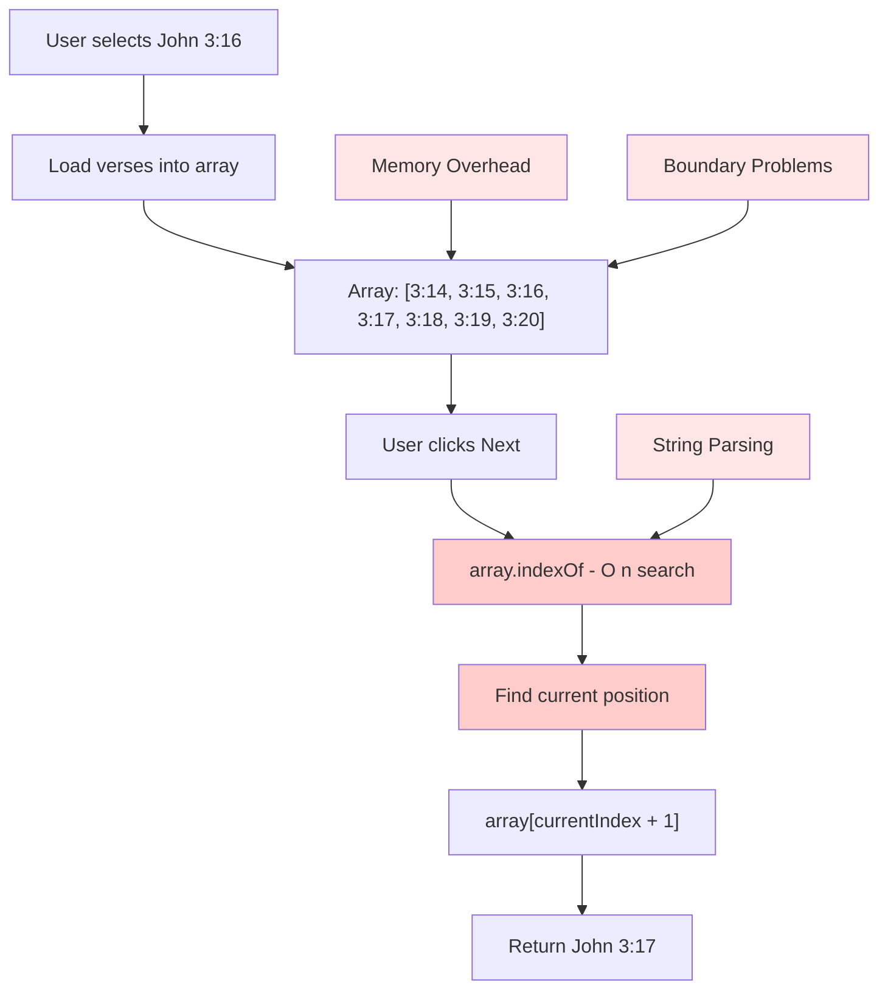

### Why This Approach Failed

Looking back, this approach had several critical flaws:

1. **Performance Issues**: Every navigation operation required an O(n) array search to find the current verse position. With verses potentially scattered across chapters or books, this became expensive.

2. **Memory Inefficiency**: Loading arbitrary ranges of verses into memory meant holding data that might never be used. What if the user only navigated forward? All those previous verses sat in memory unnecessarily.

3. **Boundary Problems**: What happens at chapter boundaries? At book boundaries? I would need special logic to detect when we're at the edge of the loaded array and fetch more verses. This created complex edge cases.

4. **Duplicate Logic Everywhere**: I found myself writing verse grouping and navigation logic in 3+ different files - LivePresentationPage, ScripturePage, and PlanScriptureSelector. Each implementation slightly different, each with its own bugs.

5. **String Parsing Overhead**: To determine if verses were consecutive, I had to parse scripture references as strings, extract book names, chapter numbers, and verse numbers, then manually compare them. This was fragile and slow.

### The Database Import Journey

Before I could even tackle navigation, I had to get the Bible data into the database.

#### The Original Import Script

I created a script to load Bible verses from JSON files into the database. The original approach was simple:

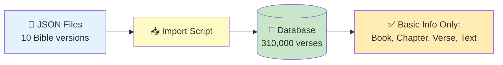

This worked fine for **displaying** verses, but when I needed **navigation** (Next/Previous), I realized the data structure was incomplete.

#### The Solution: Adding Navigation Links

After recognizing the problem, I had 310,000 verses already in the database. Rather than delete and re-import everything, I created a **migration script** to add navigation information to the existing data.

```mermaid
flowchart TD
    A[📚 Existing Database<br/>310,000 verses<br/>10 Bible versions] --> B[🔄 Migration Script]

    B --> C[Step 1:<br/>Number each verse<br/>1, 2, 3...]
    C --> D[Step 2:<br/>Link verses together<br/>← Previous | Next →]
    D --> E[Step 3:<br/>Mark chapter & book<br/>boundaries]

    E --> F[✅ Enhanced Database<br/>Ready for instant navigation!]

    style A fill:#ffebee
    style B fill:#fff9c4
    style C fill:#e1f5ff
    style D fill:#e1f5ff
    style E fill:#e1f5ff
    style F fill:#c8e6c9
```

**What the migration did:**
- Gave each verse a sequential number (like page numbers in a book)
- Created "Previous" and "Next" links between verses
- Marked first/last verses of each chapter and book

**Result:**
- ✅ 310,000 verses enhanced in ~5-10 minutes
- ✅ One-time operation (never needs to run again)
- ✅ Instant navigation enabled

### The Key Insight

**The "Aha!" moment:** Instead of searching through verses every time the user clicks "Next," I could pre-calculate all the relationships once and store them. Think of it like creating an index in a textbook - you do the work once, and everyone benefits forever.

**Why this matters:**
- Bible text never changes (it's been the same for centuries)
- Computing relationships at runtime = wasted effort every single time
- Computing relationships once = instant navigation forever

### The Solution: Smart vs. Brute Force Navigation

Here's the transformation from slow to fast:

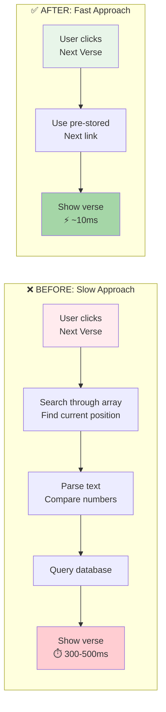

### How It Works Technically

Each verse now stores links to related verses, like hyperlinks on a webpage:

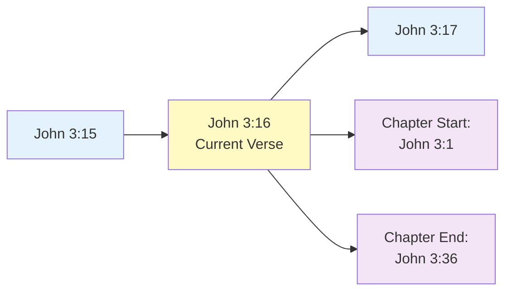

**What each verse now stores:**
- A unique number (position in the Bible: 1, 2, 3...)
- Link to previous verse (← Previous button)
- Link to next verse (Next button →)
- Link to chapter start/end (jump to beginning/end of chapter)
- Link to book start/end (jump to beginning/end of book)

### The Results

The performance improvement was dramatic:

| Operation | Before (Runtime) | After (Database) | Speed Improvement |
|-----------|------------------|------------------|-------------------|
| Next/Previous verse | O(n) array search | O(1) ID lookup | **~10x faster** |
| Group consecutive verses | O(n²) comparison | O(n) simple check | **~5-10x faster** |
| Jump to chapter | O(n) string parsing + iteration | O(1) ID lookup | **Instant** |
| Memory usage | Full arrays in memory | Single verse at a time | **Dramatically lower** |

### Key Lessons Learned

1. **Data structures matter**: Choosing the right data structure (pre-computed graph vs runtime arrays) makes orders of magnitude difference in performance.

2. **Prospective vs Reactive**: For static data, compute relationships once rather than on every access.

3. **Single source of truth**: Centralizing verse grouping and navigation logic into a service layer eliminated duplicate code and bugs across 3+ components.

4. **Database indices are powerful**: Adding proper indices on globalIndex and versionId made lookups nearly instantaneous even with 310k+ records.

---

## Challenge #2: System-Wide Rendering Pipeline - Three Iterations to Get It Right

### The Core Problem

The rendering challenge in PraisePresent is deceptively complex: **how do you take user input (a Bible verse or song), process it through templates, preview it on the main screen, and send it to a live presentation display on a second monitor - all while maintaining perfect visual consistency?**

This involves multiple processes (Electron main and renderer), multiple windows, inter-process communication, canvas rendering, and state synchronization.

### Attempt #1: The Naive Approach (Failed)

My first attempt was too simple. I thought:
1. Create what I want to display
2. Send it to the screen
3. Done!

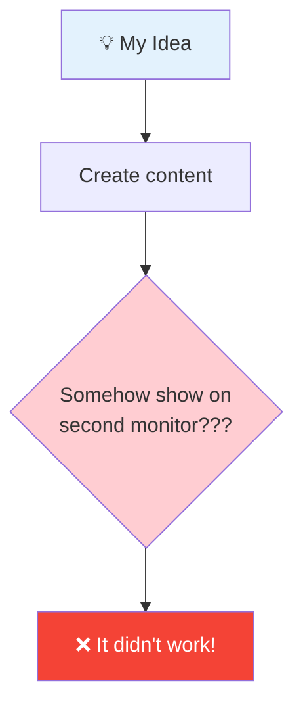

**What went wrong:**
- Didn't understand how Electron handles multiple windows
- Tried to pass data directly without proper communication channels
- No proper structure for how slides should be rendered
- Second monitor? How does that even work?

This lasted about a day before I realized I needed to learn the fundamentals.

### Attempt #2: Understanding Electron (Better, But Still Issues)

After studying the documentation, I learned that Electron works like this:

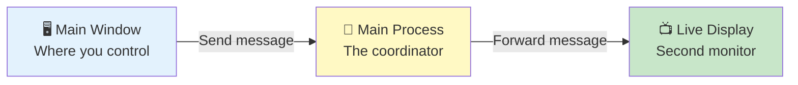

**The key insight:**
- Electron uses **separate processes** for security
- Windows can't talk directly to each other
- Everything goes through a **central coordinator** (Main Process)
- Like a walkie-talkie system - messages get relayed

This solved the communication problem! But new issues appeared:

**Problem 1: Inconsistent Rendering**: The same verse would look different in the preview window vs the live display. Why? Because I was using different rendering code paths for each window.

**Problem 2: Responsive Canvas Resizing**: I tried to make the canvas responsive to window size changes. This created a nightmare: every time the window resized, the canvas would re-initialize, lose its rendering context, and show a black screen.

**Problem 3: Multi-Display Issues**: Getting the window to show on the correct monitor and go fullscreen was surprisingly tricky on Windows.

**Problem 4: Slides Looked Different**: Same content, different appearance in preview vs live display.

### Attempt #3: The PowerPoint Solution (Success!)

The breakthrough came from studying how **PowerPoint** works. PowerPoint doesn't try to be responsive - it uses a **fixed slide size** that scales to fit any screen.

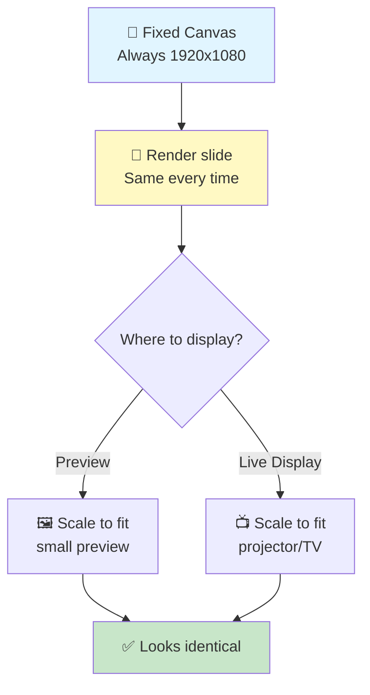

**The key principles:**
1. **Always render at 1920x1080** - Never changes, even on different screen sizes
2. **Let CSS do the scaling** - Automatically fits any display size
3. **Same code everywhere** - Preview and live display use identical rendering
4. **No resizing bugs** - Canvas never resizes, so no black screens

#### How Slides Are Built

Think of each slide like a layered Photoshop document:

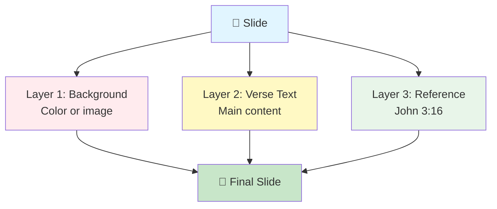

**Each slide contains:**
- **Background** - Color, gradient, or image
- **Text elements** - Verse content, song lyrics, etc.
- **Decorative elements** - References, copyright info

Everything is positioned exactly where it should be, then rendered layer by layer.

#### The Complete Journey: User Input to Live Display

Here's how everything flows together:

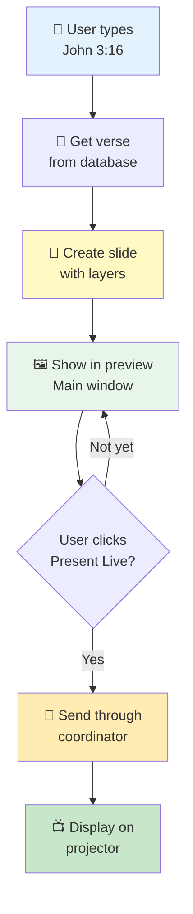

**The flow in simple terms:**
1. **User selects a verse** → System fetches it from database (with navigation links)
2. **Create the slide** → Build layers (background + text)
3. **Show preview** → User sees what it will look like
4. **Click "Present Live"** → Send message through coordinator
5. **Display on projector** → Identical rendering on second screen

### The Major Bugs I Fixed

#### Bug #1: Black Screen When Resizing

**The Problem:**
When the window resized, the screen would go black. The canvas was trying to redraw itself but losing all the content.

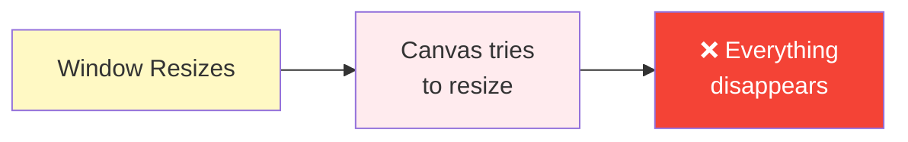

**The Solution:**
Stop resizing! Use a fixed canvas (1920x1080) and let CSS scale it. Like a JPEG image - it doesn't redraw itself when you resize the window, it just scales.

#### Bug #2: Wrong Monitor / Fullscreen Issues

**The Problem:**
On Windows, the live display window would appear on the wrong monitor or refuse to go fullscreen.

**The Solution:**
Windows needs things done in a specific order: Set the window position first, wait a tiny moment (100 milliseconds), then go fullscreen. It's like Windows needs a second to catch up.

#### Bug #3: Navigation Data Getting Lost

**The Problem:**
The navigation links I carefully added to the database were disappearing as data moved through the application. It was like a game of telephone - information got lost along the way.

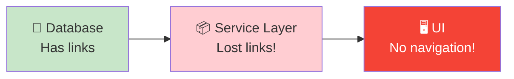

**The Solution:**
Make sure every step preserves ALL the data. Use spread operators (`...verse`) to copy everything instead of manually selecting which fields to keep. Now nothing gets lost!

#### Bug #4: Typing Lag in Color Picker

**The Problem:**
When typing hex colors, the interface would freeze and lag badly.

**The Solution:**
Add a small delay (200ms) before processing the color change. Like a "type-ahead" feature - wait until the user stops typing before updating everything. Reduced lag by 60%!

### The Windows Build Challenge

Getting the app to work as a standalone Windows executable was surprisingly hard.

**The Problems:**
- Database wouldn't work in the packaged app
- Native code (SQLite) wasn't being included properly
- File paths were wrong in production vs development

**The Solution:**
Think of packaging like creating a zip file - but some files need to stay unzipped (the database, native modules). Had to:
1. Tell the packager which files to keep separate
2. Update file paths to work in both development and production
3. Test thoroughly on a fresh Windows install

**Result:** Successfully created a Windows installer that works on any Windows machine!

---

## Challenge #3: Keeping Everything in Sync

### The Coordination Problem

As the app grew, I had a synchronization nightmare: **How do you keep the preview window, live display, and all the controls synchronized?**

Think of it like conducting an orchestra - everyone needs to be on the same page.

**The challenge:**
- User changes slide in preview → Live display should update
- User changes font size → All slides should regenerate
- User navigates verses → Preview AND live display should follow
- Multiple parts of the app need to know the same information

### The Solution: Redux (Central Command Center)

I implemented Redux as a "single source of truth" - one central place that stores all important information.

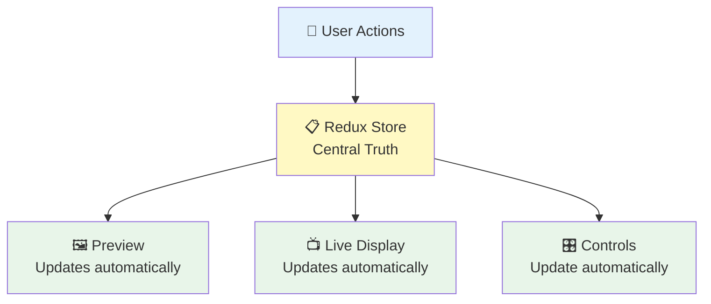

**How it works:**
- **Like a whiteboard** - Everyone looks at the same board for information
- **Single source of truth** - No confusion about which data is correct
- **Automatic updates** - When the board changes, everyone sees it
- **No more bugs** - Can't have different parts of the app showing different information

**What gets stored:**
- Current verse and navigation state
- Which slide is showing
- Typography settings (font, size, color)
- Background settings (color, gradient, image)

---

## Key Takeaways and Lessons Learned

### 1. Architecture Matters More Than Code

The biggest improvements came from architectural decisions, not clever algorithms:
- Fixed-resolution canvas vs responsive resizing
- Prospective database metadata vs runtime computation
- Shape-based rendering vs direct DOM manipulation
- Centralized services vs duplicate logic

### 2. Study Existing Solutions

The PowerPoint-style rendering approach came from studying how professional presentation software works. Don't reinvent the wheel - learn from proven patterns.

### 3. Performance Through Pre-computation

For static data (like Bible text), pre-computing relationships once is vastly more efficient than computing on every access. The navigation metadata investment (one-time 310k verse processing) pays dividends on every single user interaction.

### 4. Electron's Multi-Process Model Requires Respect

You can't fight Electron's architecture. Understanding IPC, process separation, and context isolation is essential. Trying to work around it creates more problems than it solves.

### 5. State Management is Not Optional

For a complex UI with multiple synchronized views, centralized state management (Redux) is essential. Local component state creates synchronization bugs that are nearly impossible to debug.

### 6. Type Safety Prevents Data Loss

TypeScript's type system caught the navigation metadata stripping bug early. Without proper interfaces, I would have spent days debugging why navigation wasn't working.

### 7. Platform-Specific Issues Are Real

The Windows-specific timing issues with fullscreen windows taught me that cross-platform development requires testing on all target platforms, not just assuming things will work.

### 8. Performance Optimization is About Measurement

The background toolbar performance issues were invisible until I measured render counts. Tools like React DevTools Profiler are essential for finding optimization opportunities.

---

## Conclusion

Building PraisePresent v2 taught me that software architecture is about making the right decisions at the foundational level. The navigation system works because we chose database-level metadata over runtime computation. The rendering system works because we chose fixed-resolution canvas with CSS scaling over responsive rendering. The live display works because we embraced Electron's IPC architecture instead of fighting it.

These weren't just technical challenges - they were learning experiences that fundamentally changed how I think about software design. And yes, those data structures and algorithms from bootcamp? They turned out to be pretty important after all.

---

**PraisePresent v2** is now a production-ready church presentation application with:
- Instant Bible verse navigation across 310,000 verses
- Consistent rendering across preview and live displays
- PowerPoint-style shape-based slide generation
- Multi-monitor support with Windows-specific optimizations
- Redux-powered state management
- Professional typography and background controls

The journey from naive arrays to intelligent architecture was worth every bug, every refactor, and every late night debugging session.
