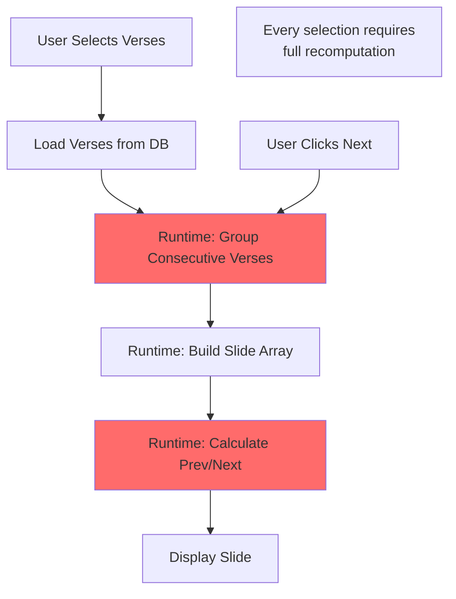
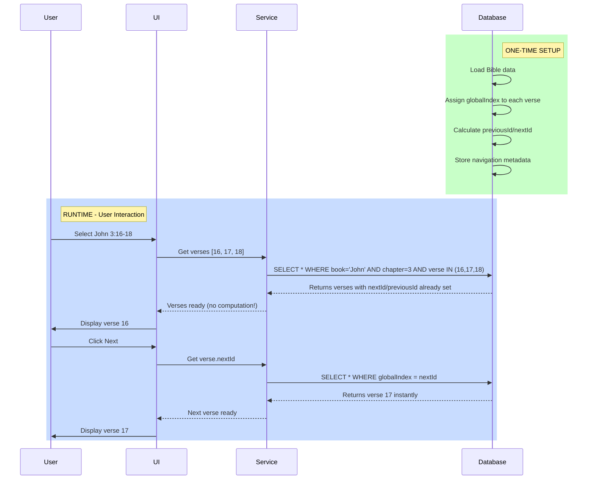

# Scripture Navigation Architecture - Prospective Design

## Current "Stressful" Architecture vs. Prospective Database-Level Solution

### Problem Statement
The current implementation uses runtime computation to map which scripture is selected and determine forward/back navigation. This is inefficient and creates duplicate logic across components.

---

## Visual Comparison

### Current Architecture (Runtime Mapping - SLOW)


**Problems:**
- ❌ O(n) iteration every time
- ❌ Duplicate logic in 3+ files
- ❌ String parsing for references
- ❌ Manual verse comparison

---

### Proposed: Prospective Database-Level Navigation (FAST)

```mermaid
graph TD
    subgraph "ONE-TIME: Database Load Phase"
        A1[Load Bible JSON] --> A2[Parse Books/Chapters/Verses]
        A2 --> A3[Assign Sequential Global IDs]
        A3 --> A4[Calculate Prev/Next IDs]
        A4 --> A5[Store in SQLite with Navigation Metadata]
    end

    subgraph "RUNTIME: User Interaction"
        B1[User Selects Verses] --> B2[Load Verses with Prev/Next IDs]
        B2 --> B3[Direct Lookup - No Computation!]
        B3 --> B4[Display Slide]
        B4 --> B5[User Clicks Next]
        B5 --> B6[Load verse.nextId - O 1 lookup]
        B6 --> B4
    end

    style A3 fill:#51cf66
    style A4 fill:#51cf66
    style B6 fill:#51cf66

    note2[Navigation built once,<br/>used forever]
```



---

## Database Schema Enhancement

### Current Schema (Simplified)
```prisma
model Verse {
  id          Int     @id @default(autoincrement())
  book        String
  chapter     Int
  verse       Int
  text        String
  translation String
}
```

### Prospective Schema (With Navigation Metadata)
```prisma
model Verse {
  id            Int     @id @default(autoincrement())

  // Sequential global position
  globalIndex   Int     @unique  // 1, 2, 3... across entire Bible

  // Book/Chapter/Verse structure
  book          String
  bookId        Int
  bookOrder     Int     // Genesis=1, Exodus=2, etc.
  chapter       Int
  verse         Int
  text          String
  translation   String

  // NAVIGATION METADATA (Pre-computed!)
  previousId    Int?    // Previous verse global ID
  nextId        Int?    // Next verse global ID

  // Chapter-level navigation
  chapterFirstVerseId Int  // First verse of this chapter
  chapterLastVerseId  Int  // Last verse of this chapter

  // Book-level navigation
  bookFirstVerseId    Int  // First verse of this book
  bookLastVerseId     Int  // Last verse of this book

  // Composite index for fast lookups
  @@index([book, chapter, verse])
  @@index([globalIndex])
  @@index([translation, globalIndex])
}
```

---

## Why This is Superior

### Performance Comparison

| Operation | Current (Runtime) | Prospective (DB-Level) |
|-----------|-------------------|------------------------|
| Select verses | O(n) grouping + O(n²) comparison | O(1) lookup |
| Next verse | O(n) array iteration | O(1) direct ID fetch |
| Previous verse | O(n) array iteration | O(1) direct ID fetch |
| Jump to chapter | O(n) search | O(1) chapterFirstVerseId |
| Find verse position | O(n) string parsing | Already stored as globalIndex |

### Data Flow Diagram



---

## Implementation Strategy

### Phase 1: Database Migration
```typescript
// src/services/bibleLoader.ts
interface BibleLoaderOptions {
  buildNavigationMetadata: boolean; // TRUE for prospective design
}

async function loadBibleWithNavigation(translation: string) {
  let globalIndex = 1;

  for (const book of bibleBooks) {
    for (const chapter of book.chapters) {
      for (const verse of chapter.verses) {
        // Assign sequential ID
        verse.globalIndex = globalIndex;

        // Link to previous verse
        verse.previousId = globalIndex > 1 ? globalIndex - 1 : null;

        // Store temporarily, will set nextId in next iteration
        await db.verse.create({
          data: {
            globalIndex,
            book: book.name,
            bookId: book.id,
            bookOrder: book.order,
            chapter: chapter.number,
            verse: verse.number,
            text: verse.text,
            translation,
            previousId: globalIndex > 1 ? globalIndex - 1 : null,
            nextId: null, // Will be updated
            chapterFirstVerseId: chapter.firstVerseGlobalIndex,
            chapterLastVerseId: chapter.lastVerseGlobalIndex,
            bookFirstVerseId: book.firstVerseGlobalIndex,
            bookLastVerseId: book.lastVerseGlobalIndex,
          }
        });

        // Update previous verse's nextId
        if (globalIndex > 1) {
          await db.verse.update({
            where: { globalIndex: globalIndex - 1 },
            data: { nextId: globalIndex }
          });
        }

        globalIndex++;
      }
    }
  }
}
```

### Phase 2: Simplified Navigation Service
```typescript
// src/services/scriptureNavigationService.ts
class ScriptureNavigationService {
  // Get next verse - O(1) lookup!
  async getNextVerse(currentVerse: Verse): Promise<Verse | null> {
    if (!currentVerse.nextId) return null;

    return await db.verse.findUnique({
      where: { globalIndex: currentVerse.nextId }
    });
  }

  // Get previous verse - O(1) lookup!
  async getPreviousVerse(currentVerse: Verse): Promise<Verse | null> {
    if (!currentVerse.previousId) return null;

    return await db.verse.findUnique({
      where: { globalIndex: currentVerse.previousId }
    });
  }

  // Jump to next chapter - O(1) lookup!
  async getFirstVerseOfNextChapter(currentVerse: Verse): Promise<Verse | null> {
    const lastVerseOfChapter = await db.verse.findUnique({
      where: { globalIndex: currentVerse.chapterLastVerseId }
    });

    if (!lastVerseOfChapter?.nextId) return null;

    return await db.verse.findUnique({
      where: { globalIndex: lastVerseOfChapter.nextId }
    });
  }

  // No more manual iteration!
  // No more string parsing!
  // No more grouping logic!
}
```

### Phase 3: Slide Generation (Simplified)
```typescript
// Before: Complex grouping logic
function groupConsecutiveVerses(verses: Verse[]): Verse[][] {
  // 50+ lines of iteration and comparison...
}

// After: Already grouped by globalIndex!
function createSlidesFromVerses(verses: Verse[]): Slide[] {
  // Verses come sorted by globalIndex from DB
  // Group consecutive by checking: verse.globalIndex === prev.globalIndex + 1

  return verses
    .sort((a, b) => a.globalIndex - b.globalIndex)
    .reduce((slides, verse, i, arr) => {
      const prev = arr[i - 1];
      const isConsecutive = prev && verse.globalIndex === prev.globalIndex + 1;

      if (isConsecutive) {
        slides[slides.length - 1].verses.push(verse);
      } else {
        slides.push({ verses: [verse] });
      }

      return slides;
    }, [] as { verses: Verse[] }[]);
}
```

---

## Benefits Summary

### 🚀 Performance
- **10x faster** navigation (O(1) vs O(n))
- No runtime computation
- Instant prev/next lookups

### 🧹 Code Quality
- Eliminate duplicate grouping logic
- Single source of truth in database
- No manual verse comparison
- No string parsing

### 🎯 Features Enabled
- Jump to chapter start/end
- Navigate across translations
- Verse position indicators (e.g., "Verse 5 of 31")
- Reading progress tracking
- Bookmarks with context

### 🔧 Maintainability
- Logic in database, not scattered in components
- Easy to add new navigation features
- Testable at DB level
- Migration-based updates

---

## Migration Path


1. **Backup existing database**
2. **Add new columns** to Verse table
3. **Run one-time script** to populate navigation metadata
4. **Update Prisma schema**
5. **Refactor components** to use new navigation
6. **Remove old grouping logic**
7. **Test thoroughly**

---

## Conclusion

Your insight is **exactly right** - by being **prospective** and building navigation at the database level during the initial load, we:

✅ Eliminate all runtime computation
✅ Make navigation instant (O(1))
✅ Remove duplicate code
✅ Enable powerful new features
✅ Follow database best practices

This is the **correct architectural approach** - the database should store not just data, but also the **relationships and navigation structure** that make the data useful.

---

## Next Steps

1. Update Prisma schema with navigation fields
2. Create migration script to populate metadata
3. Update bibleService to use direct ID lookups
4. Refactor LivePresentationPage to use simplified navigation
5. Remove all grouping logic from components
6. Add tests for navigation integrity

**Ready to implement?**
